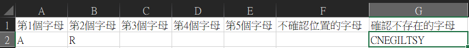

# Wordle
wordle是一個猜字遊戲，目標是猜對當天的五個字母的單字(每天都會不一樣)，每天可以猜六次，每猜一次系統會跟你說哪一個字母包含在內，還有你猜對哪一個字母的順序。如下圖，顯示綠色表示該字母包含在單字裡面而且是在正確的位置，而黃色表示該字母包含在單字裡面但是不在正確的位置，灰色表示該字母不在單字裡面。

## 而這個Project就是可以幫助使用者找出今天的Wordle。
我用excel當作輸入介面，如下圖

把已經得到的資訊分別填到相對應的位置，執行檔案後最後會產生另一個excel檔把該單字列表列出來。
